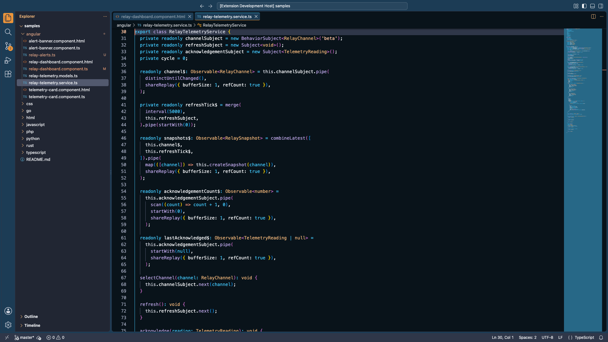
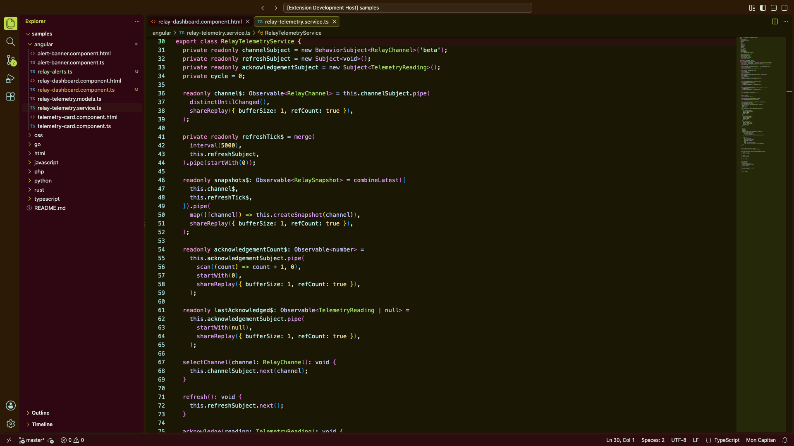
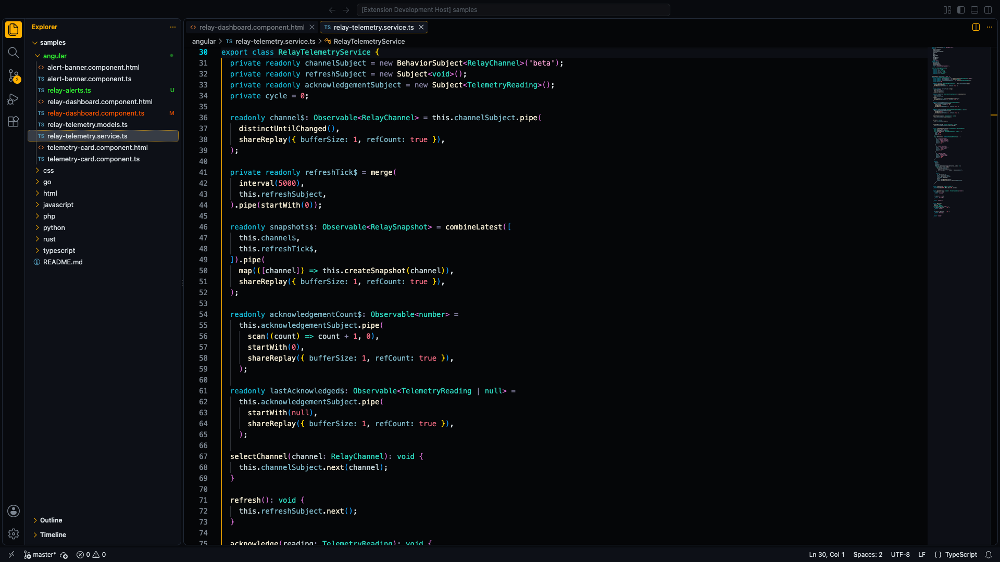
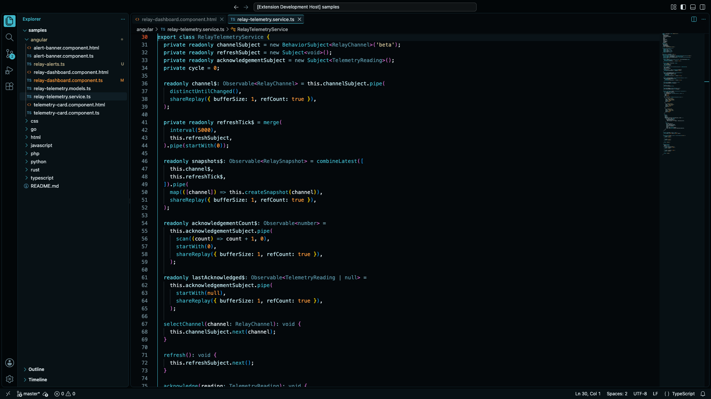
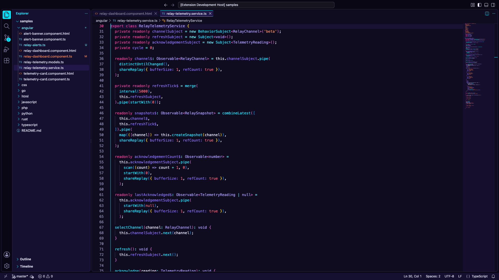
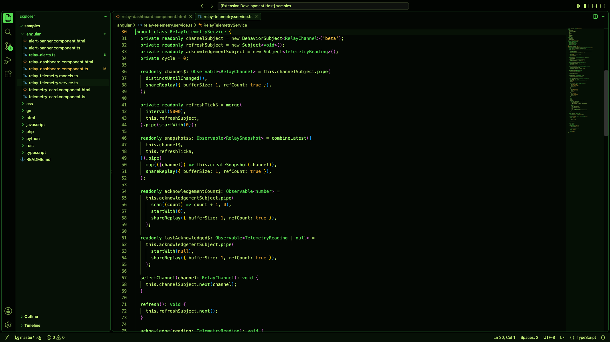
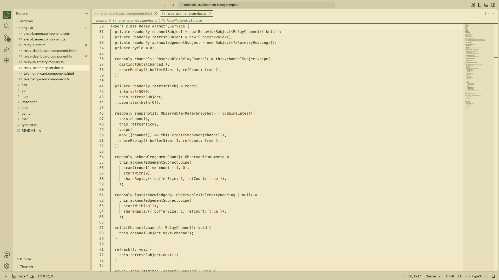
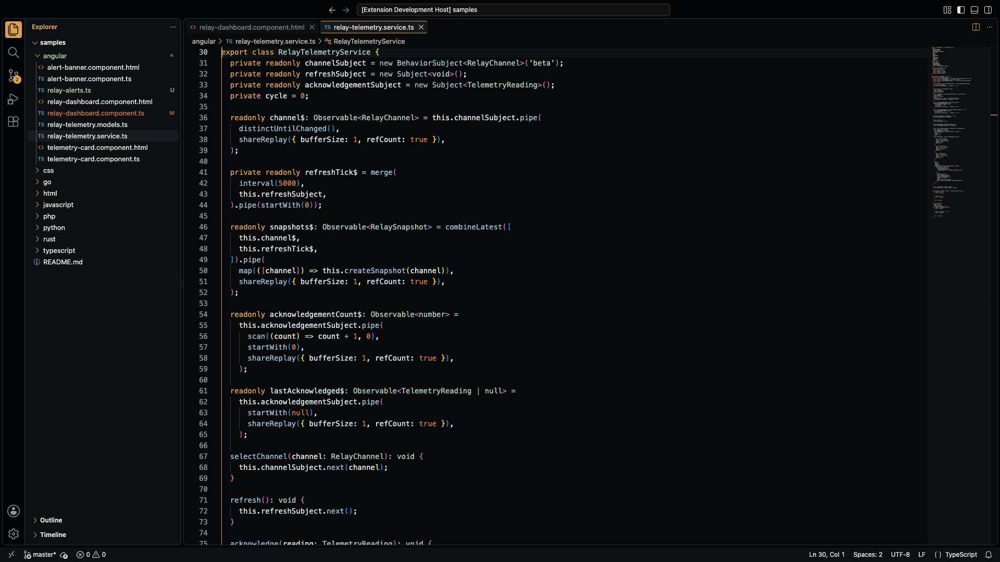
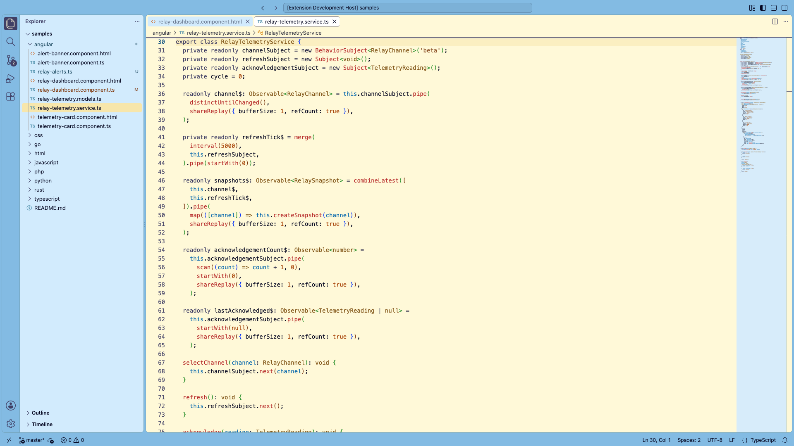
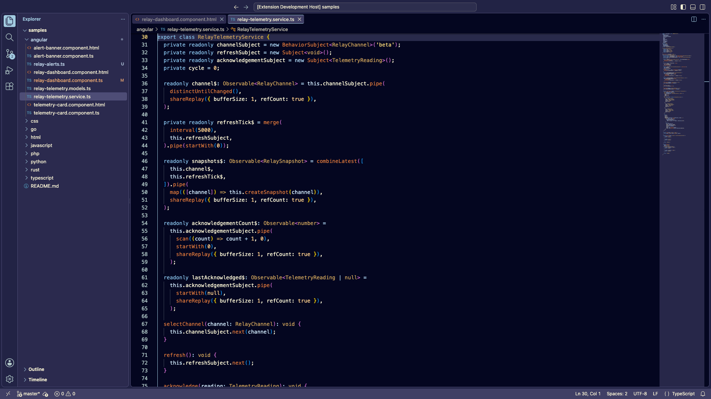

# Esper Themes

High-contrast color themes for Visual Studio Code: the LCARS-inspired LCARS
theme, six film themes carried over from Deckard's webview themes, two Bluey
themes, and a generated Q theme.

| Theme | Type | Look |
| --- | --- | --- |
| LCARS | Dark | Starfleet console panels. |
| Replicant | Dark | Near-black night exteriors, with syntax keyed to the 1982 film's own grade: petrol and cyan structure, neon signage for the literals. |
| Oblivion | Dark | Steel frames and cyan readouts, with orange kept for alerts. |
| Synthwave | Dark | Neon cyan and hot pink on violet night. |
| Tomcat | Dark | Green phosphor cockpit display with amber warnings. |
| Fellowship | Light | Parchment with olive greens and aged gold. |
| Cooper | Dark | White-on-black instrument readouts and Gargantua's gold. |
| Bluey | Light | Heeler-family daylight: cream paper, pale blue chrome. |
| Bluey Night | Dark | The same palette after bedtime, on Bluey's navy. |
| Q | Dark | A new accessible palette generated on demand. |

The root `COLOR-ACCESSIBILITY.md` file records the approved palette, its theme
roles, and the accessibility rationale for each assignment.

The Problems, Output, Debug Console, Ports, and related panel content use the
same dark surface as the editor and terminal. Panel section headers retain
each theme's identity color through the supported
`panelSectionHeader.*` roles; VS Code's Modern UI top panel strip shares the
native `panel.background` role.

VS Code's Modern UI (`workbench.experimental.modernUI`) draws the active
editor tab's top and bottom strokes only from `workbench.colorCustomizations`,
not from theme files. While Modern UI is on, the extension adds the active
theme's tab border colors to that setting under the theme's scope, without
replacing values you have set yourself.

## Screenshots

Regenerate these with `npm run capture:screenshots` (or name themes, as in
`npm run capture:screenshots -- Replicant Q`). Each capture opens the sample
code in an isolated VS Code Extension Development Host.

<!-- theme-screenshots:start -->

### LCARS



### Q



### Replicant



### Oblivion



### Synthwave



### Tomcat



### Fellowship



### Cooper



### Bluey



### Bluey Night



<!-- theme-screenshots:end -->

## Film themes

Replicant, Oblivion, Synthwave, Tomcat, Fellowship, and Cooper are generated
from the palettes of the matching Deckard webview themes. The palettes live in
`scripts/build-themes.js`; after changing one, rebuild the theme files
with:

```sh
npm run build:themes
```

The script maps each palette onto the same workbench roles the Q generator
uses, and adjusts any text color that falls short of WCAG AA (4.5:1) on its
surfaces before writing the theme.

## Bluey themes

Bluey (light) and Bluey Night (dark) are built from the characters' own colors,
sampled from the family artwork: navy `#040620`, purple-navy `#403F65`, Bluey
blue `#83BBE3`, steel `#75A6BE`, pale blue `#D2EBFD`, cream `#FFF9D8`, gold
`#EDCE74`, Bandit orange `#FFB070`, Bingo orange `#E37A3B`, Chilli's brown
`#9B5E33`, and the tongue red `#C9504F`.

Colors are paired the way the artwork paints them. Measuring which colors
actually touch on the characters gives blue with steel, navy with purple-navy,
pale blue with steel, blue with pale blue, cream with orange, brown with
orange, brown with gold, and gold with pale blue. The themes follow those
pairings: the workbench runs along the navy and purple-navy of Bluey's head,
code structure (keywords, operators, variables) takes the blues of his body,
and literals (strings, numbers, constants, types) take the warm family shared
by the muzzles, Chilli and Bingo.

Both are generated by `npm run build:themes`, so their text colors are
darkened or lightened only as far as WCAG AA requires.

## Theme palette reference

`theme-palettes.html` is a self-contained page (open it directly in a browser)
with an interactive mock VS Code window for every theme, its palette, and a
live WCAG contrast table. Regenerate its embedded data after changing a theme:

```sh
npm run build:palette-page
```

## Q generated theme

Select **Q** from **Preferences: Color Theme** to enable the runtime-generated
theme. The extension creates a new dark workbench palette and readable code
foregrounds; every generated text pair is required to meet WCAG AA contrast
of at least 4.5:1, including the composited backgrounds used by selections
and hover states.

While Q is active, click **Mon Capitan** in the status bar to generate another
palette. The same action is available in the Command Palette as
**Esper Themes: Generate Q Theme**. The generated values are stored as Q-scoped VS
Code color customizations, so the fixed LCARS
theme is not changed.

## Saving generated Q themes

While Q is active, run **Esper Themes: Save Current Q Theme** from the Command Palette
and give the palette a name. Run **Esper Themes: Pick Saved Q Theme** later to restore
any saved workbench and syntax palette; saved snapshots are kept in the
extension's global storage and do not create separate theme files.

## Development

Open this folder in VS Code and press `F5` to launch an Extension Development
Host. In that window, use **Preferences: Color Theme** and select **LCARS**.

The generated `.vscode/launch.json` starts the theme with the same
Extension Host development-path pattern used by Deckard:

```text
--extensionDevelopmentPath=${workspaceFolder}
```

## Packaging

Package the extension with:

```sh
npm ci
npm run package:vsix
```

Install the resulting VSIX through **Extensions: Install from VSIX...**.

Pull requests and pushes to `master` are validated and packaged by GitHub
Actions. A push to `master` creates a GitHub Release and attaches the VSIX
when the version in `package.json` has not been released before.

