
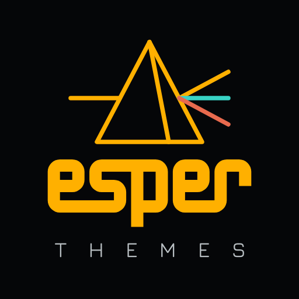

# Esper Themes

High-contrast, film-inspired color themes for Visual Studio Code.

Install **Esper Themes** from the Marketplace, then pick a theme under **Preferences: Color Theme**.

<!-- theme-screenshots:start -->

### 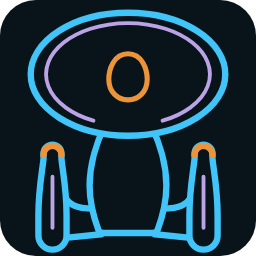 LCARS

Starfleet console panels.

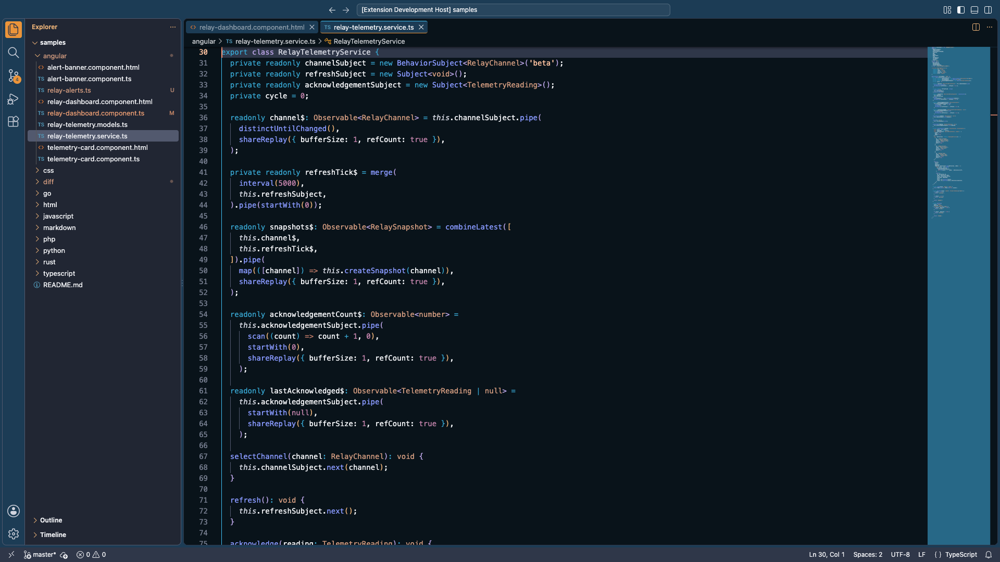

###  Q

A new accessible palette, generated on demand.

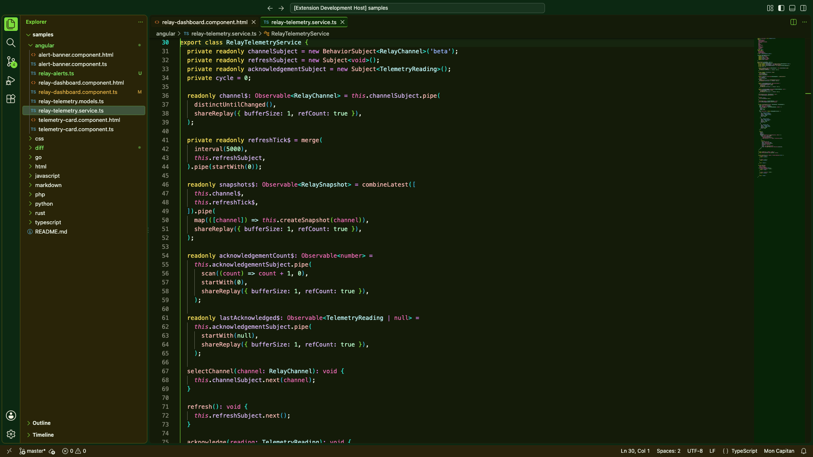

### 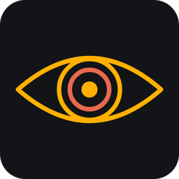 Replicant

Near-black night exteriors: petrol and cyan structure, neon signage for the literals.

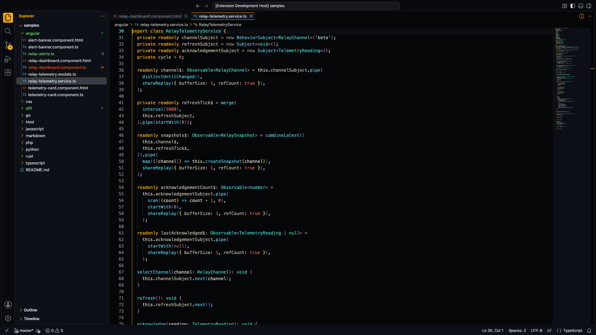

### 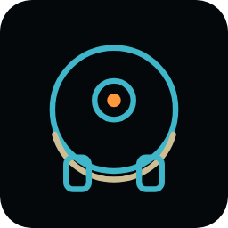 Oblivion

Steel frames and cyan readouts, with orange kept for alerts.

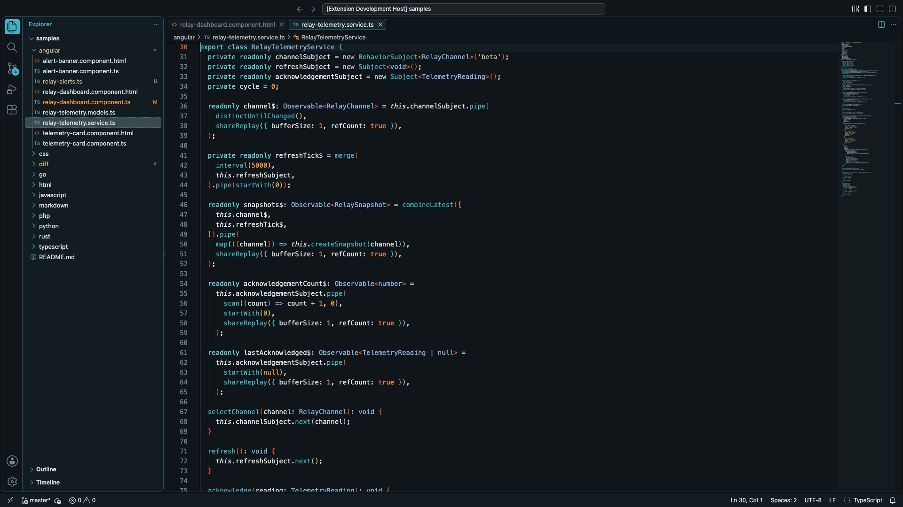

### 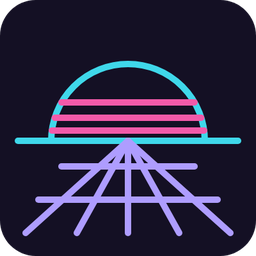 Synthwave

Neon cyan and hot pink on violet night.

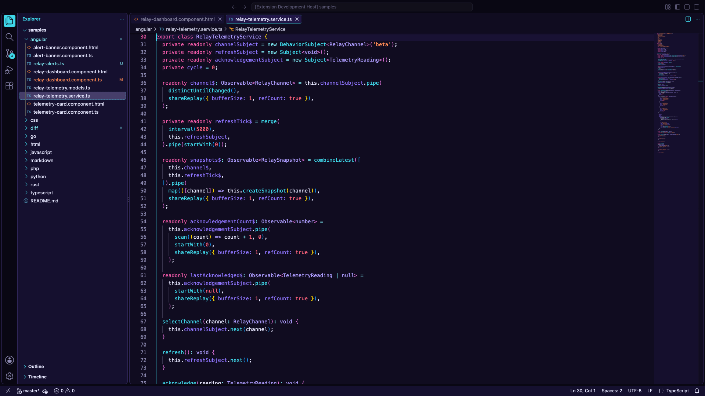

### 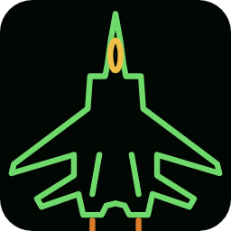 Tomcat

Green phosphor cockpit display with amber warnings.

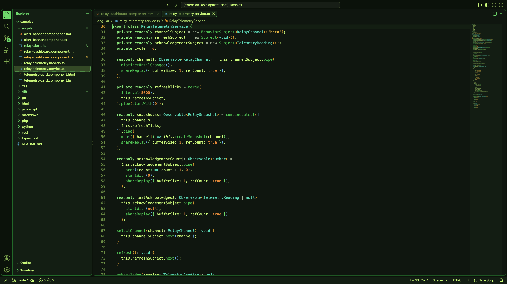

###  Fellowship

Light. Parchment with olive greens and aged gold.

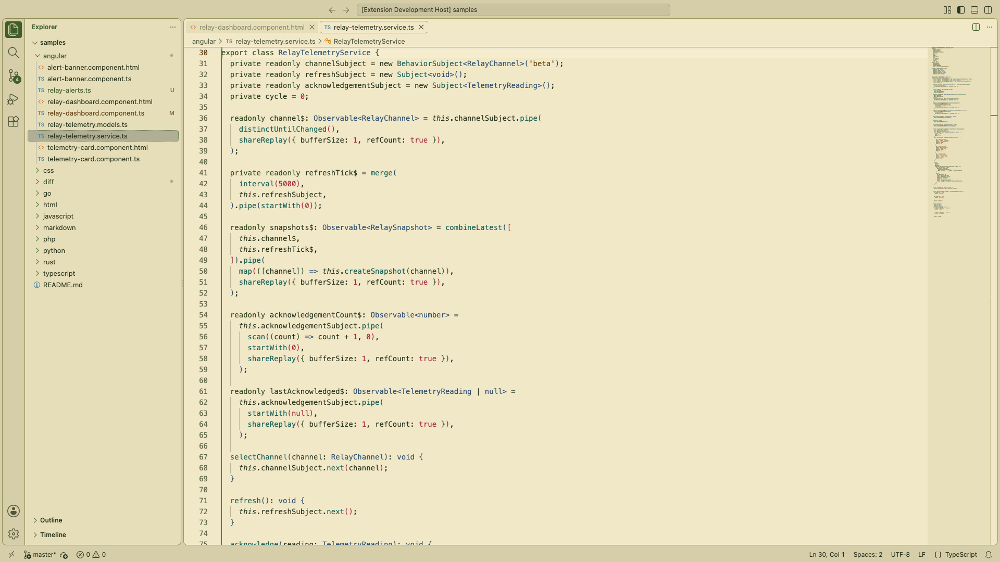

### 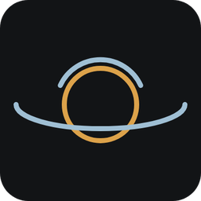 Cooper

White-on-black instrument readouts and Gargantua's gold.

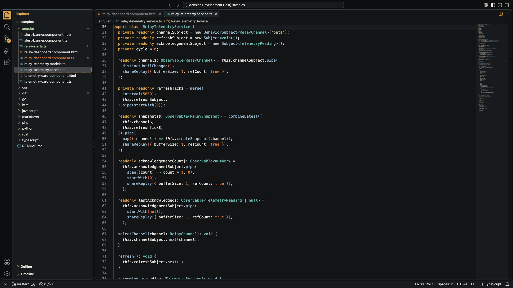

###  Bluey

Light. Heeler-family daylight: cream paper, pale blue chrome.

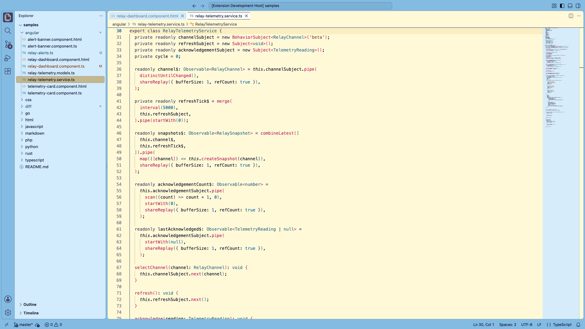

### 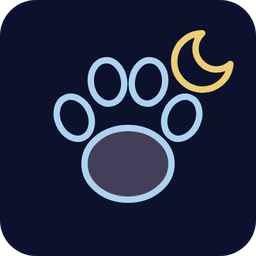 Bluey Night

The same palette after bedtime, on Bluey's navy.

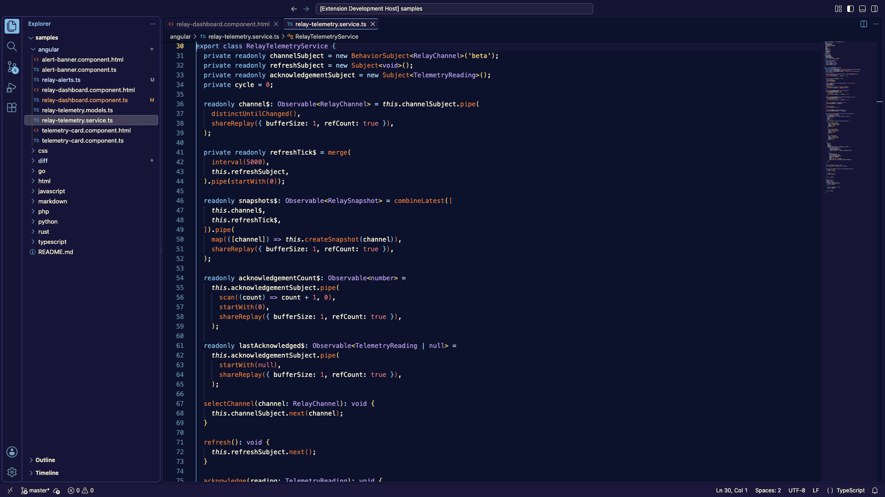

### 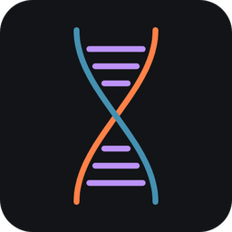 Helix

Steel blue, dusty rose and lavender on Replicant's near-black. A custom theme that has been my friend through many dangers.

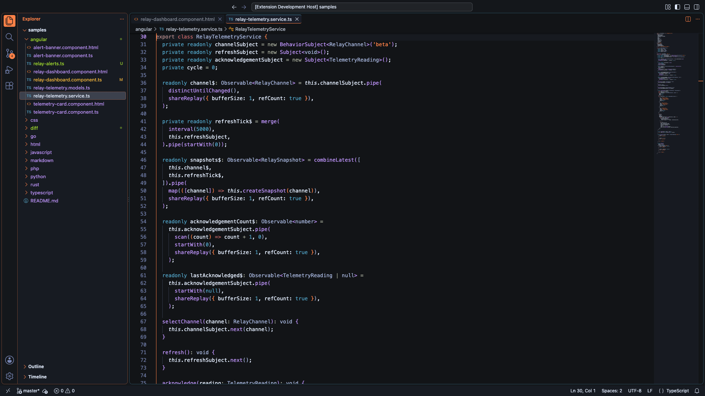

### 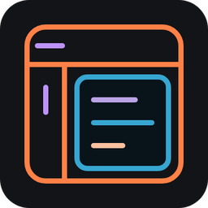 Mix

Any theme's workbench around any other's editor colors. Shown as it ships: Helix around LCARS.

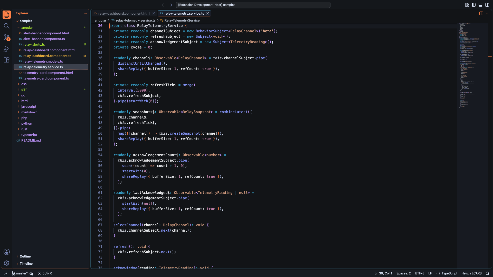

<!-- theme-screenshots:end -->

## Q

Q deals a new dark palette on request. Every text pair it generates meets WCAG AA (4.5:1).

- Pick **Q** as your color theme.
- Click **Mon Capitan** in the status bar, or run **Esper Themes: Generate Q Theme**, for a new palette.
- **Esper Themes: Save Current Q Theme** keeps the one you have. **Esper Themes: Pick Saved Q Theme** brings a saved one back.

## Mix

Mix wears one theme's workbench around another theme's editor colors.

- Pick **Mix** as your color theme. As shipped it is Helix's workbench around LCARS's syntax.
- Run **Esper Themes: Mix Themes**, or click the pair in the status bar, and choose the theme for the workbench and the theme for the editor colors. The editor background counts as workbench.
- Syntax colors are lifted where the new ground needs it, so a palette tuned for a near-black editor still reads on parchment.

## Development

- `npm run build:themes` rebuilds the fixed themes from the palettes in `scripts/build-themes.js`.
- `npm run capture:screenshots` retakes the screenshots above.
- `npm run build:palette-page` regenerates `theme-palettes.html`, a palette and contrast page for every theme.
- `npm run package:vsix` builds the extension. A push to `master` publishes a release.

Palette choices and the contrast rationale behind them are in `COLOR-ACCESSIBILITY.md`.
